# Plots

## Forest (?) plot

``` r

p1 <- gg_model_coef(m, color = "darkred")
p1
```

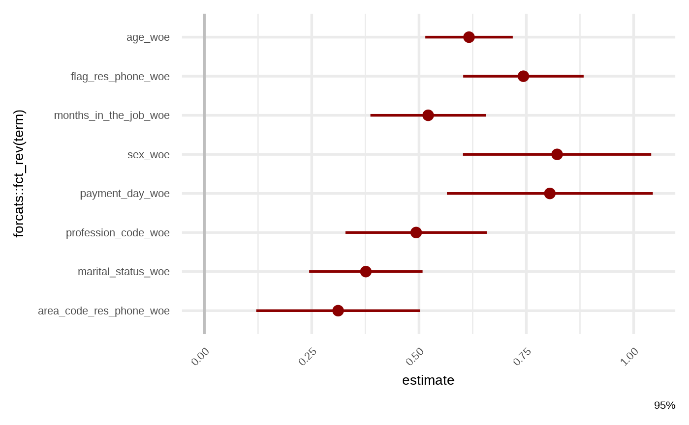

## Variable importance

Done via *Variable Dropout Plot*.

Details in `ingredients::feature_importance`.

``` r

p2 <- gg_model_importance(m)
#> ℹ Using all variables in data.
#> ℹ Using 1 - AUCROC as loss function.
#> ℹ Using `base::identity` as sampler.
p2
```

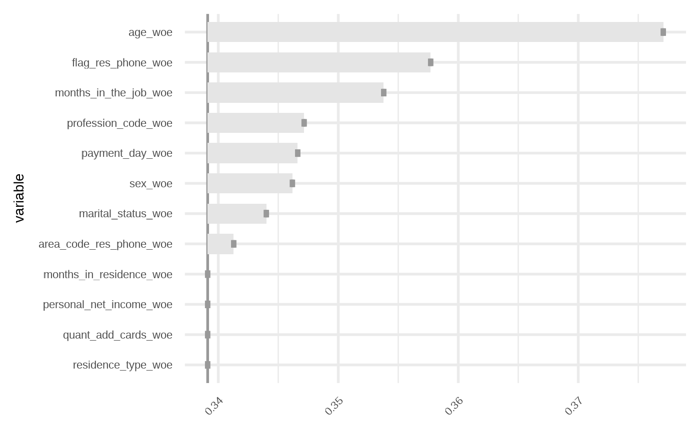

Other version bases on scorecads.

``` r

bins <- scorecard::woebin(credit, "bad", no_cores = 1)
#> ℹ Creating woe binning ...
#> Warning in check_const_cols(dt): There were 3 constant columns removed from input dataset,
#> flag_other_card, flag_mobile_phone, flag_contact_phone
#> ✔ Binning on 49694 rows and 14 columns in 00:00:02

gg_model_importance2(m, bins)
```

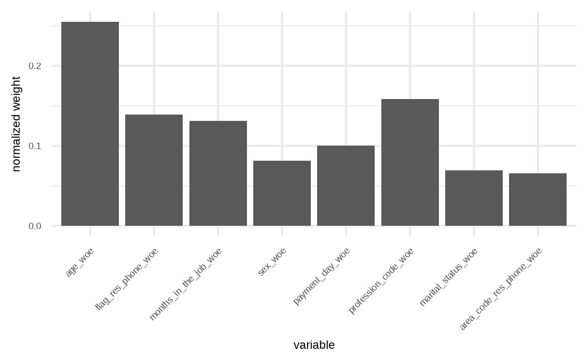

``` r

gg_model_importance2(m, bins, fill = "gray60", width = 0.5)
```

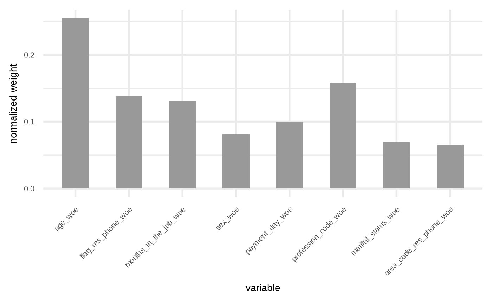

## Correlations and VIF

``` r

p3 <- gg_model_corr(m)
#> Correlation computed with
#> • Method: 'pearson'
#> • Missing treated using: 'pairwise.complete.obs'
p3
```

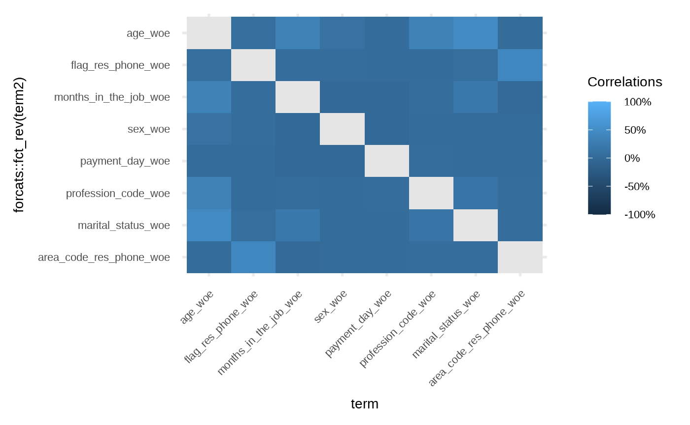

``` r


# override 
p3 +  
  ggplot2::scale_fill_viridis_c(
    name = "Cors",
    label = scales::percent,
    # limits = c(-1, 1),
    na.value = "gray90",
    # breaks = seq(-1, 1, by = 0.25)
    )
#> Scale for fill is already present.
#> Adding another scale for fill, which will replace the existing scale.
```

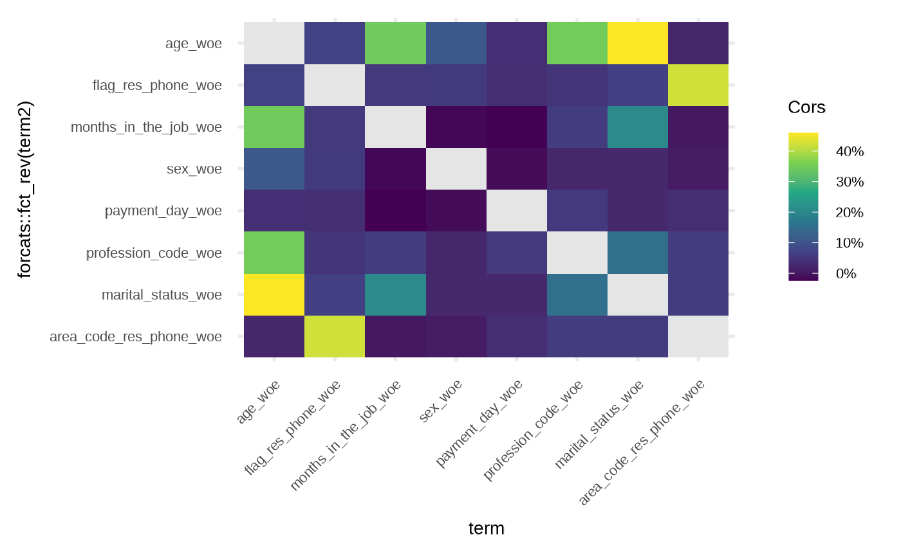

Vif plot is inspired by `see:::plot.see_check_collinearity`.

``` r

p4 <- gg_model_vif(m)
p4
```

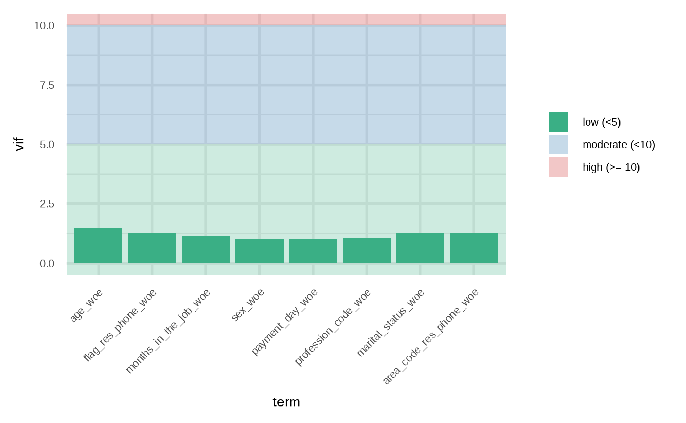

## ROC

``` r

p5 <- gg_model_roc(m, newdata = dtest, size = 2) +
  scale_color_viridis_d(begin = 0.2, end = 0.8, direction = -1, option = "B")
#> Warning: Using `size` aesthetic for lines was deprecated in ggplot2 3.4.0.
#> ℹ Please use `linewidth` instead.
#> ℹ The deprecated feature was likely used in the risk3r package.
#>   Please report the issue at <https://github.com/jbkunst/risk3r/issues>.
#> This warning is displayed once per session.
#> Call `lifecycle::last_lifecycle_warnings()` to see where this warning was
#> generated.
p5
```

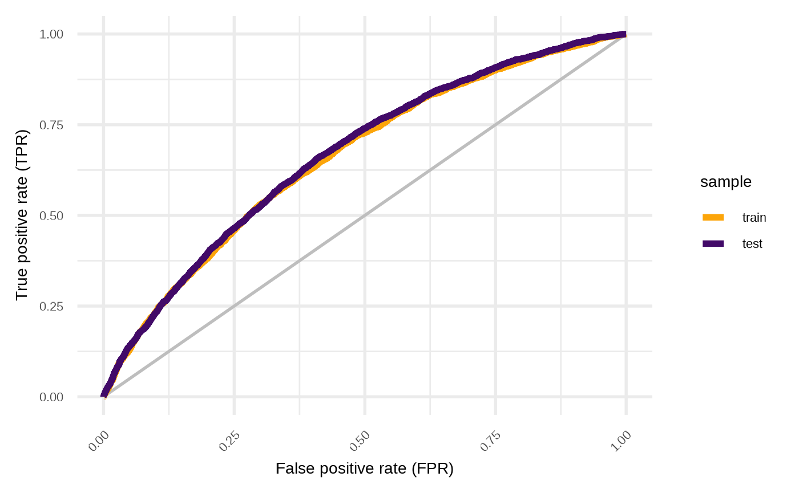

## Empirical Cumulative Distribution Function

``` r

p6 <- gg_model_ecdf(m, newdata = dtest, size = 2) +
  scale_color_viridis_d(begin = 0.2, end = 0.8, direction = -1, option = "B")
p6
```

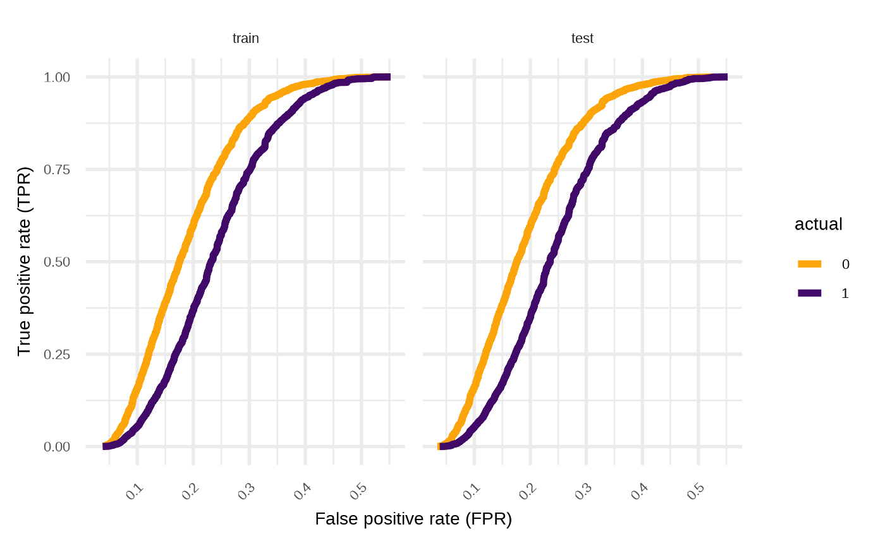

``` r


# just train
p6 <- p6 +
  ggforce::facet_wrap_paginate(ggplot2::vars(.data$sample), nrow = 1, ncol = 1, page = 1) +
  theme(strip.background = element_blank(), strip.text.x = element_blank())
p6
```

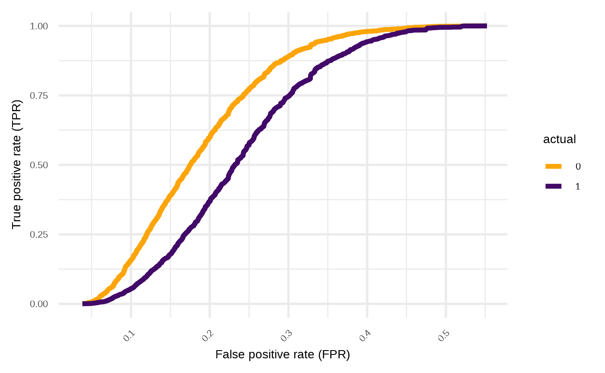

## Distributions

``` r

p7 <- gg_model_dist(m, newdata = dtest, color = "transparent", alpha = 0.4)

p7
```

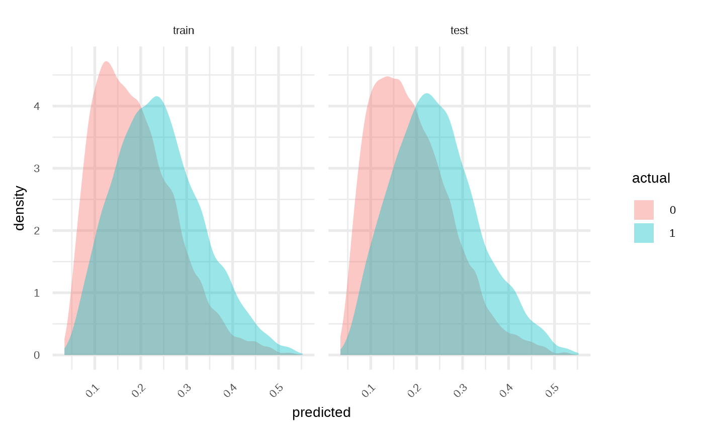

``` r


# Just train and separate distributions
p7 +
  scale_fill_viridis_d(begin = 0.2, end = 0.8, direction = -1, option = "B") +
  ggforce::facet_wrap_paginate(
    ggplot2::vars(.data$sample, .data$actual),
    nrow = 2, ncol = 1, page = 2
    ) +
  theme(strip.background = element_blank(), strip.text.x = element_blank())
```

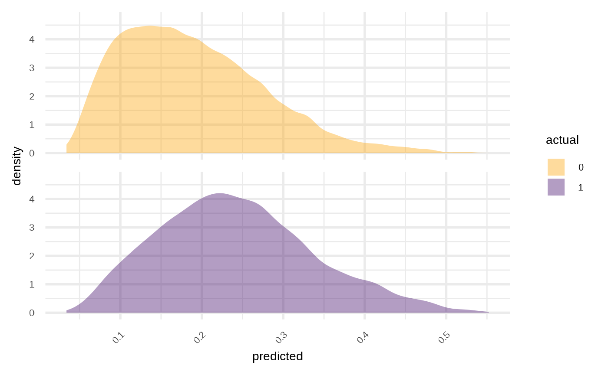

## Calibration

``` r

p8 <- gg_model_calibration(m, newdata = dtest, alpha = 0.01, size = 1, color = "darkred")

p8
#> `geom_smooth()` using method = 'gam' and formula = 'y ~ s(x, bs = "cs")'
```

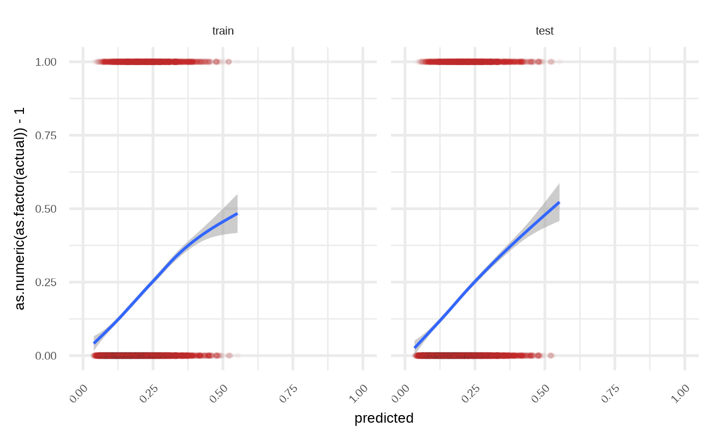

``` r


# only test and x = y
p8 +
  ggforce::facet_wrap_paginate(
    ggplot2::vars(.data$sample),
    nrow = 1, ncol = 1, page = 2
    ) +
  geom_abline(aes(slope = 1, intercept = 0), color = "gray70", size = 2) +
  theme(strip.background = element_blank(), strip.text.x = element_blank())
#> `geom_smooth()` using method = 'gam' and formula = 'y ~ s(x, bs = "cs")'
```

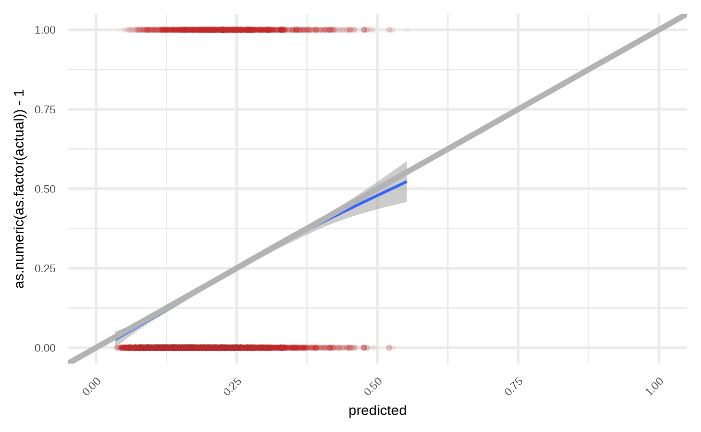

## Compose and override some lables/colors

Using patchwork.

``` r

library(patchwork)

(p1 | p2 | p3) /
  (p4 | p5 | p6)
```

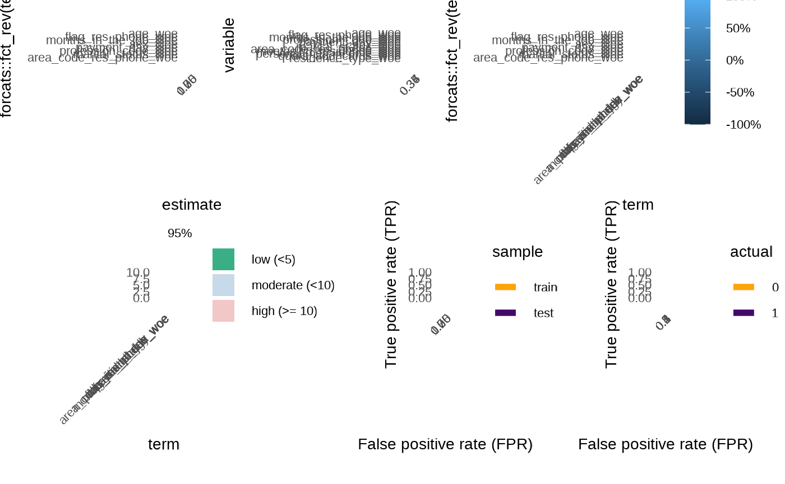

As we can see there some space we can gain

``` r

p12 <- p1 + 
  labs(caption = NULL, x = "Estimate")

p22 <- p2 +
  scale_x_discrete(breaks = "", name = NULL, limits = rev) + 
  coord_flip()
#> Coordinate system already present.
#> ℹ Adding new coordinate system, which will replace the existing one.

p32 <- p3 +
  scale_fill_viridis_c(
    name = "Cors",
    limits = c(-1, 1),
    label = scales::percent,
    na.value = "gray90",
    breaks = seq(-1, 1, length.out = 5),
    option = "B"
  ) +
  geom_text(aes(label = round(cor * 100)), color = "white", size = 2.5) +
  scale_x_discrete(breaks = "", name = NULL) +
  scale_y_discrete(breaks = "", name = NULL) +
  theme(legend.position = "right")
#> Scale for fill is already present.
#> Adding another scale for fill, which will replace the existing scale.

p42 <- p4 + 
  scale_x_discrete(limits = rev) +
  coord_flip() +
  theme(legend.position = "bottom") +
  labs(x = NULL, y = "VIF")

p52 <-  p5 +
  scale_color_viridis_d(
    name = "Sample",
    begin = 0.2,
    end = 0.8,
    option = "A",
    labels = stringr::str_to_title,
    ) +
  theme(legend.position = "bottom") 
#> Scale for colour is already present.
#> Adding another scale for colour, which will replace the existing scale.
  

p62 <- p6 +
  scale_color_viridis_d(
    name = NULL,
    begin = 0.2,
    end = 0.8,
    option = "D",
    labels =  ~ ifelse(.x == "0", "Good", "Bad")
    ) +
  labs(x = "Predicted") +
  theme(legend.position = "bottom") 
#> Scale for colour is already present.
#> Adding another scale for colour, which will replace the existing scale.

(p12 | p22 | p32) /
  (p42 | p52 | p62)
#> Warning: Removed 8 rows containing missing values or values outside the scale range
#> (`geom_text()`).
```

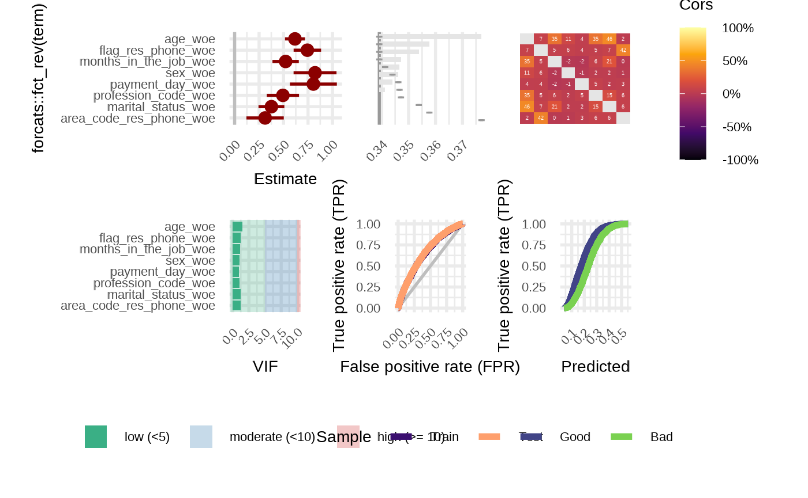
