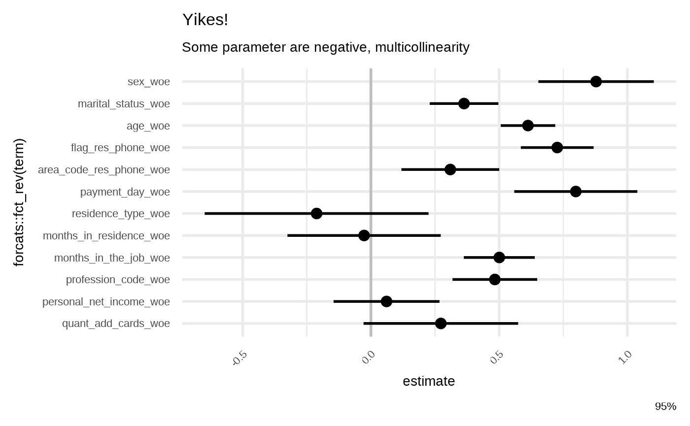
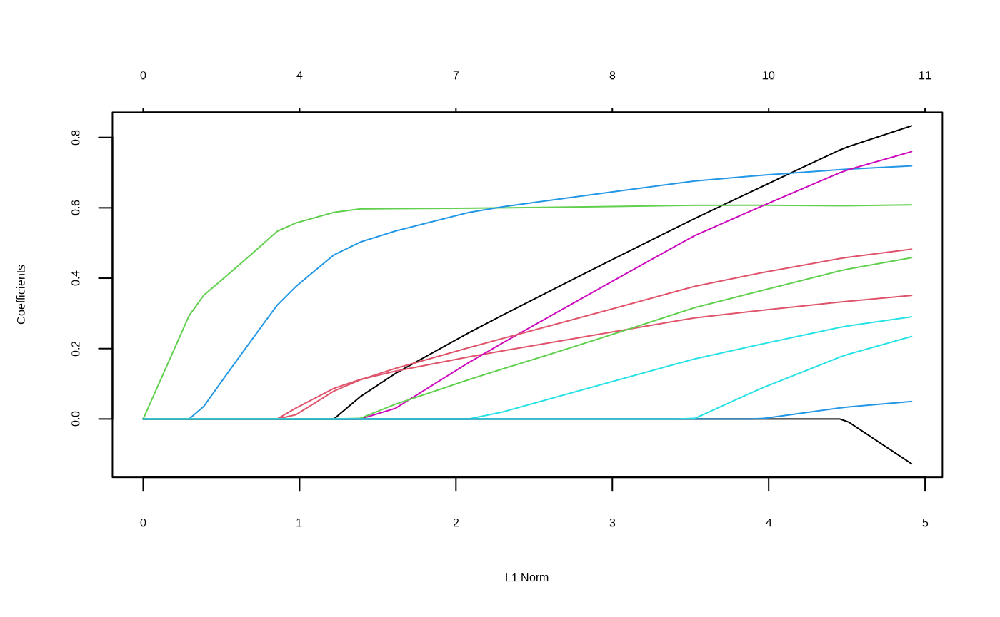
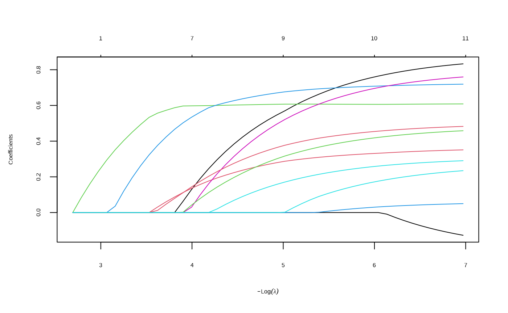
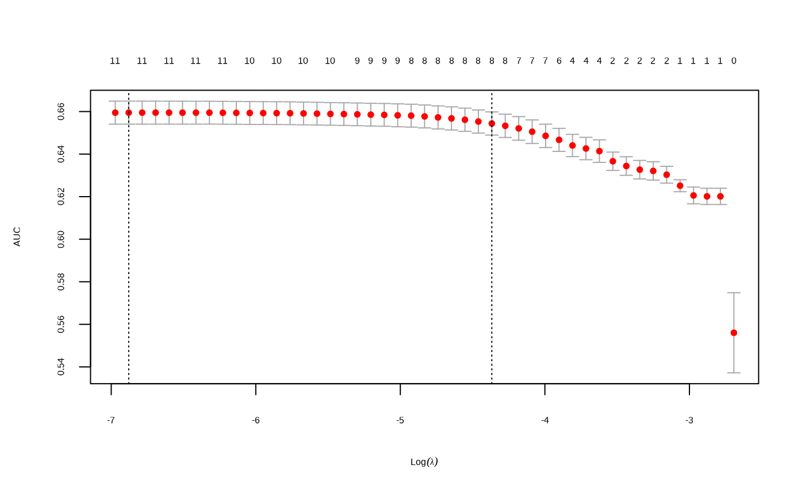
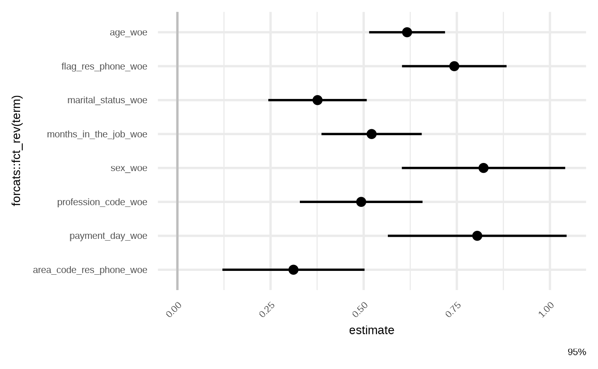
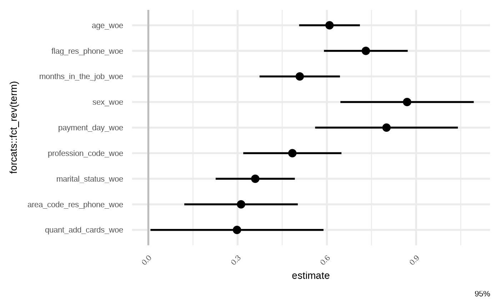
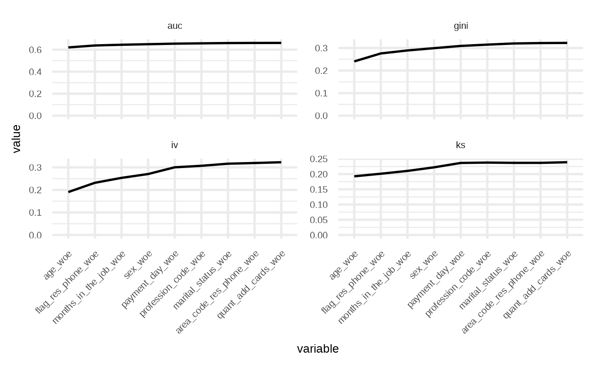

# Feature Selection

## Raw Model

Let fit a very raw model to check:

``` r

library(risk3r)
library(broom)
library(dplyr)
library(ggplot2)

data("credit_woe")

credit_woe <- select(credit_woe, -id_client_woe)
train_data <- head(credit_woe, 20000)
test_data  <- tail(credit_woe, 20000)

model_raw <- glm(bad ~ ., family = binomial, data = train_data)

gg_model_coef(model_raw) +
  labs(
    title = "Yikes!",
    subtitle = "Some parameter are negative, multicollinearity"
    )
```



## Satellite Model

We’ll use a simple random forest to have a benchmark.

``` r

model_rf <- randomForest::randomForest(bad ~ .,
                                       data = train_data,
                                       do.trace = FALSE,
                                       ntree = 100)

metrics(train_data$bad, predict(model_rf))
#> # A tibble: 1 × 4
#>      ks   auc    iv  gini
#>   <dbl> <dbl> <dbl> <dbl>
#> 1 0.183 0.628 0.214 0.256
```

## Lasso or Elasticnet Regularization

This is a wrapper of
\`[`glmnet::cv.glmnet`](https://rdrr.io/pkg/glmnet/man/cv.glmnet.html).

From <https://glmnet.stanford.edu/articles/glmnet.html>:

There 2 option for `S`: `lambda.min` and `lambda.1se` , this last option
you have a more regularized model.

This wrapper around the glmnet package take a model as input, then
return the model with the variables non zero from the
[`glmnet::cv.glmnet()`](https://rdrr.io/pkg/glmnet/man/cv.glmnet.html)
function according with the selected `S` option. This function reorder
the variables in the same order the coefficient in the glmnet model turn
to non zero (check the plots when run this funtion).

``` r

model_fsglmnet <- featsel_glmnet(model_raw, S = "lambda.1se", trace.it = FALSE)
```



``` r


gg_model_coef(model_fsglmnet)
```



## Setpwise Forward

This is a wrapper for [`stats::step`](https://rdrr.io/r/stats/step.html)
but the start point model is the null one: `response ~ 1`.

``` r

model_fsstep <- featsel_stepforward(model_raw, trace = 0)

gg_model_coef(model_fsstep)
```


## Repetitive round of drop out loss

From <https://ema.drwhy.ai/featureImportance.html>

This is a wrapper of
[`celavi::feature_selection`](https://jkunst.com/celavi/reference/feature_selection.html).

``` r

model_lss_prmt <- featsel_loss_function_permutations(model_raw)

gg_model_coef(model_lss_prmt)
```



## Comparison

``` r

models <- list(
  `raw`      = model_raw,
  `glmnet`   = model_fsglmnet,
  `stepwise` = model_fsstep,
  `loss`     = model_lss_prmt
)

models |> 
  purrr::map_df(broom::tidy, .id = "model") |> 
  select(model, term) |> 
  mutate(value = 1) |> 
  tidyr::spread(model, value) |> 
  mutate(across(where(is.numeric), tidyr::replace_na, 0)) |> 
  select(term, raw, stepwise, glmnet, loss) |> 
  arrange(desc(raw), desc(stepwise), desc(glmnet), desc(loss))
#> # A tibble: 13 × 5
#>    term                      raw stepwise glmnet  loss
#>    <chr>                   <dbl>    <dbl>  <dbl> <dbl>
#>  1 (Intercept)                 1        1      1     1
#>  2 age_woe                     1        1      1     1
#>  3 area_code_res_phone_woe     1        1      1     1
#>  4 flag_res_phone_woe          1        1      1     1
#>  5 marital_status_woe          1        1      1     1
#>  6 months_in_the_job_woe       1        1      1     1
#>  7 payment_day_woe             1        1      1     1
#>  8 profession_code_woe         1        1      1     1
#>  9 sex_woe                     1        1      1     1
#> 10 quant_add_cards_woe         1        1      0     1
#> 11 months_in_residence_woe     1        0      0     0
#> 12 personal_net_income_woe     1        0      0     0
#> 13 residence_type_woe          1        0      0     0


models |> 
  purrr::map_df(model_metrics, newdata = test_data, .id = "model")
#> # A tibble: 4 × 5
#>   model       ks   auc    iv  gini
#>   <chr>    <dbl> <dbl> <dbl> <dbl>
#> 1 raw      0.248 0.667 0.350 0.334
#> 2 glmnet   0.249 0.667 0.348 0.333
#> 3 stepwise 0.248 0.667 0.349 0.334
#> 4 loss     0.248 0.667 0.349 0.334
```

## Manual

Let suppose you have a nice model, but you want to reduce the number of
variables.

Maybe you want check:

``` r

model_partials(model_fsstep)
#> # A tibble: 9 × 5
#>   variable                   ks   auc    iv  gini
#>   <fct>                   <dbl> <dbl> <dbl> <dbl>
#> 1 age_woe                 0.193 0.620 0.191 0.240
#> 2 flag_res_phone_woe      0.201 0.638 0.232 0.276
#> 3 months_in_the_job_woe   0.210 0.645 0.254 0.289
#> 4 sex_woe                 0.222 0.650 0.271 0.299
#> 5 payment_day_woe         0.237 0.655 0.300 0.309
#> 6 profession_code_woe     0.238 0.657 0.307 0.315
#> 7 marital_status_woe      0.237 0.660 0.316 0.320
#> 8 area_code_res_phone_woe 0.237 0.661 0.319 0.322
#> 9 quant_add_cards_woe     0.239 0.661 0.323 0.322

gg_model_partials(model_fsstep) +
    ggplot2::facet_wrap(
      ggplot2::vars(.data$key), ncol = 2,
      scales = "free_y"
      )
```


