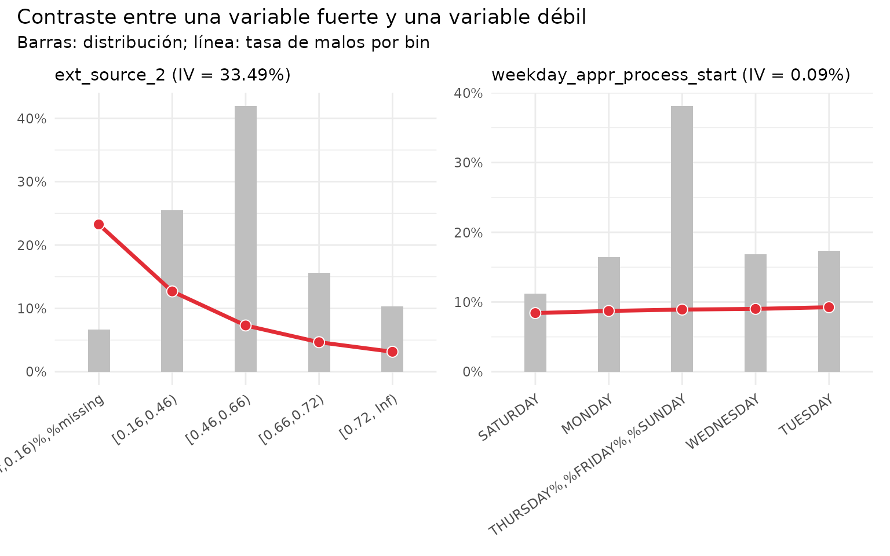
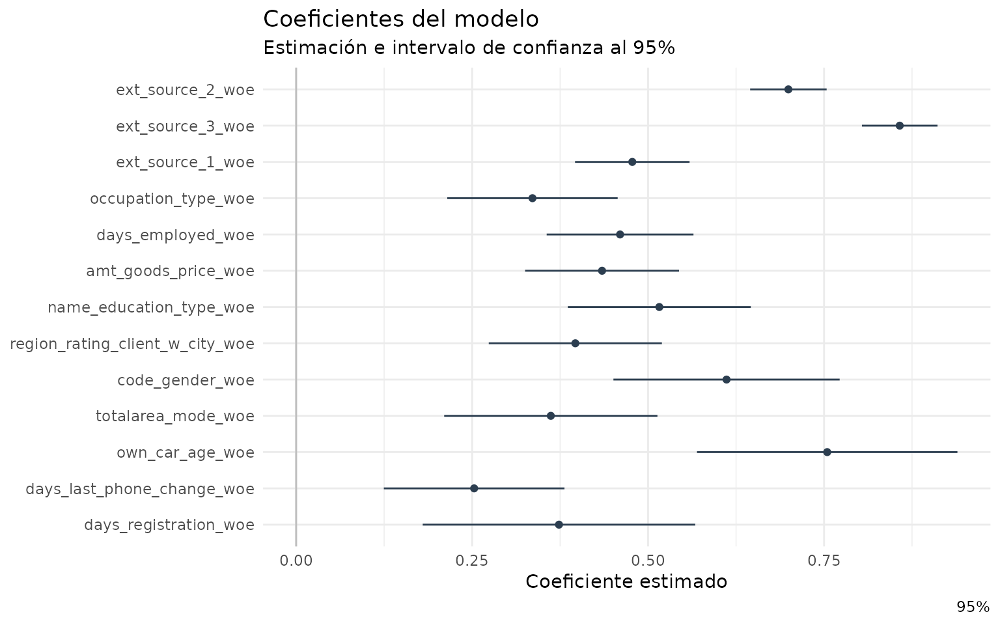
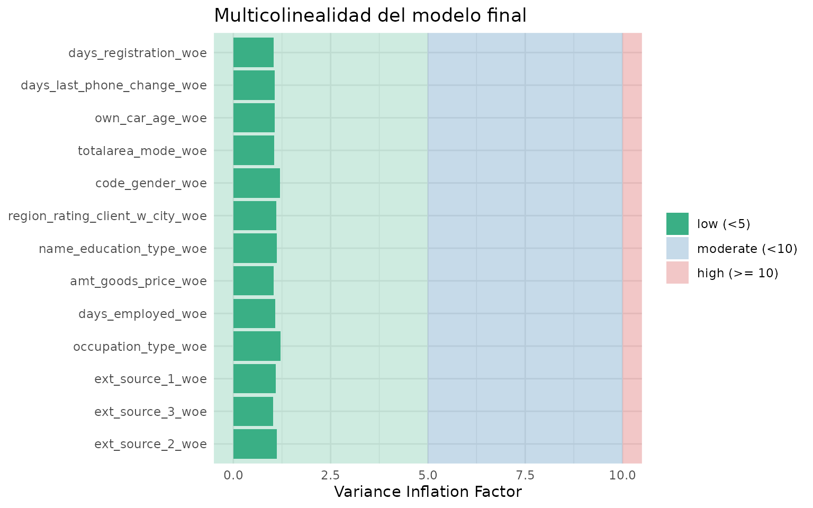
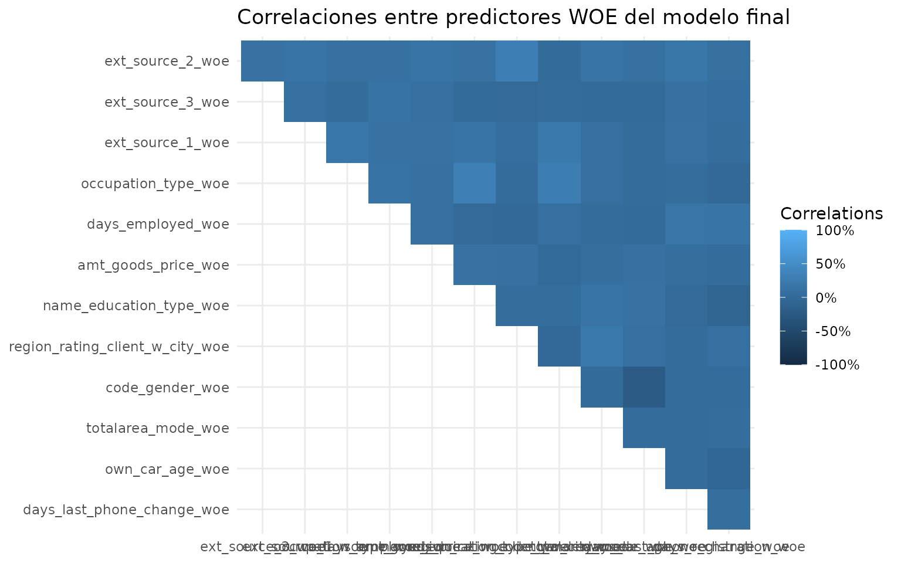
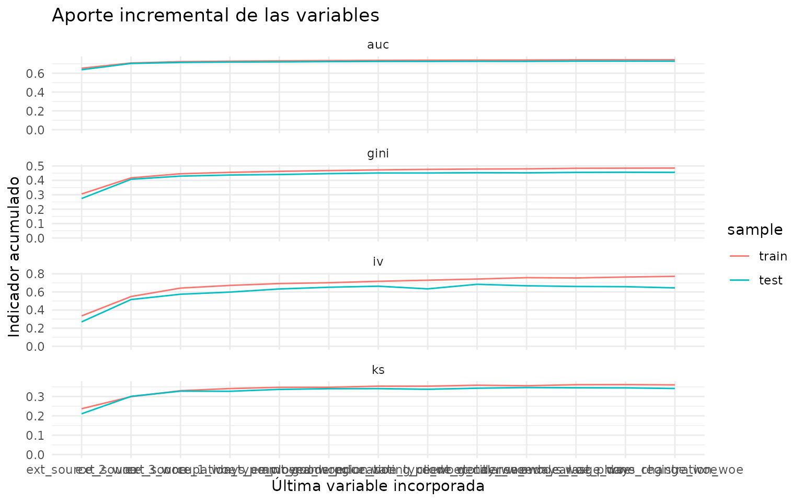
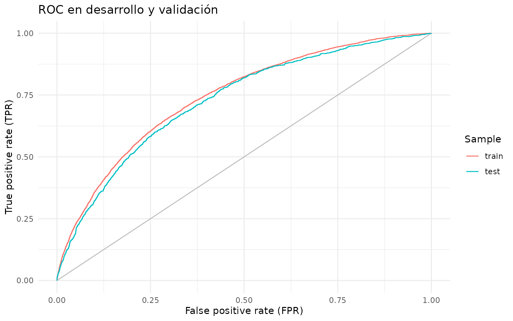
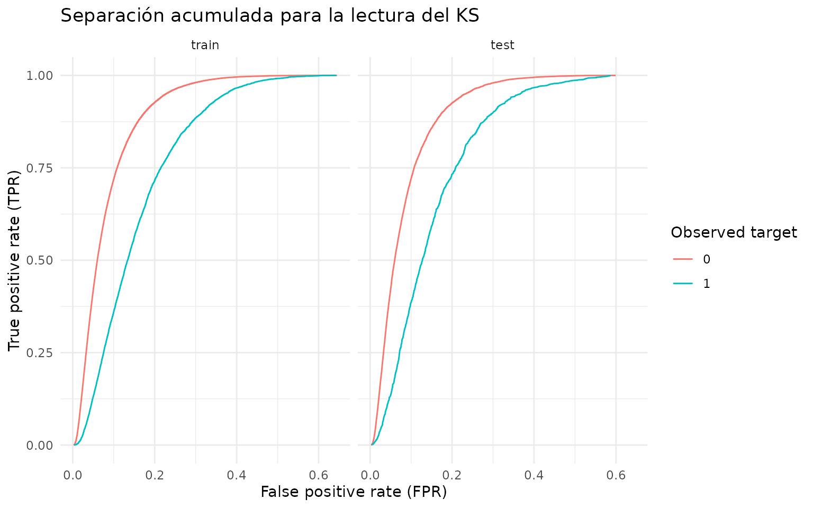
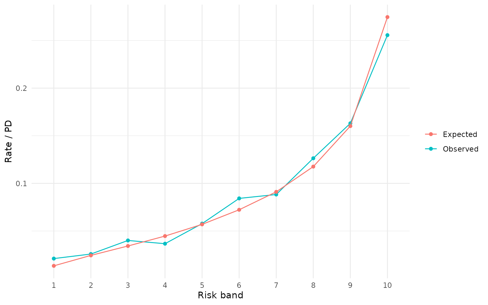
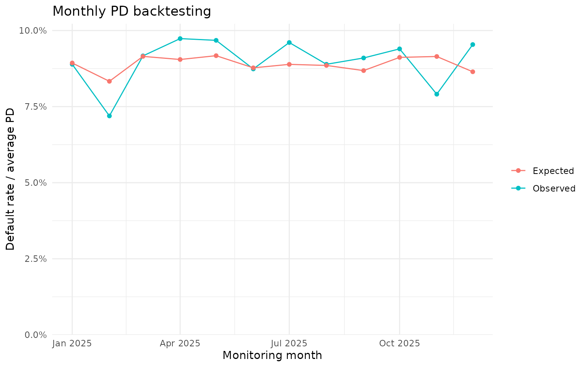

# Desarrollo de un scorecard con Home Credit

## Propósito y alcance

Esta viñeta presenta, de principio a fin, el desarrollo pedagógico de un
scorecard de originación. El modelo estima la probabilidad de
dificultades de pago (`target = 1`) de una solicitud de crédito. El
resultado se transforma en una PD, un puntaje y una regla de decisión
ilustrativa.

El ejemplo sirve para aprender metodología. No constituye una política
de crédito ni un modelo apto para producción. Antes de usar un scorecard
en un banco deben revisarse representatividad, sesgo de aprobación,
estabilidad, regulación, gobierno y validación independiente.

### Mapa del proceso

1.  Comprender la población y el target.
2.  Auditar y filtrar observaciones.
3.  Separar desarrollo y validación.
4.  Construir bins y transformar a WOE.
5.  filtrar variables por IV, concentración y monotonicidad.
6.  Resolver redundancia y correlación.
7.  Estimar y seleccionar el modelo logístico.
8.  Evaluar discriminación y calibración.
9.  Convertir la PD a score, bandas y una decisión ilustrativa.
10. Preparar un backtesting de PD observada versus esperada.

## Preparación

Los objetos se asignan explícitamente para que cada etapa pueda
inspeccionarse, modificarse y enseñarse por separado.

``` r

library(risk3r)
library(scorecard)
library(dplyr)
#> 
#> Attaching package: 'dplyr'
#> The following objects are masked from 'package:stats':
#> 
#>     filter, lag
#> The following objects are masked from 'package:base':
#> 
#>     intersect, setdiff, setequal, union
library(ggplot2)
library(purrr)
library(rsample)
library(tidyr)
#> 
#> Attaching package: 'tidyr'
#> The following object is masked from 'package:scorecard':
#> 
#>     replace_na

theme_set(theme_minimal())

set.seed(2026)

# Use Inf para trabajar con las 307.511 observaciones.
course_sample_n <- 100000
correlation_limit <- 0.70
iv_min <- 0.02
max_variables <- 14L
max_relative_performance_variation <- 0.10
max_income <- 1000000

data("home_credit_application", package = "risk3r")

applications <- home_credit_application

if (is.finite(course_sample_n) && nrow(applications) > course_sample_n) {
  applications <- applications |>
    group_by(target) |>
    slice_sample(prop = course_sample_n / nrow(applications)) |>
    ungroup()
}
```

## 1. Población, unidad de análisis y target

Cada fila representa una solicitud. `sk_id_curr` identifica la solicitud
y no debe utilizarse como predictor. El evento `target = 1` representa
dificultades de pago según la definición de Home Credit.

En un desarrollo real también se documentan la ventana de observación,
la ventana de desempeño, la maduración y las exclusiones. Esta tabla no
contiene fechas completas para reconstruir esas ventanas.

``` r

target_summary <- applications |>
  summarise(
    applications = n(),
    unique_applications = n_distinct(sk_id_curr),
    bads = sum(target == 1, na.rm = TRUE),
    bad_rate = mean(target == 1, na.rm = TRUE)
  )

target_summary
#> # A tibble: 1 × 4
#>   applications unique_applications  bads bad_rate
#>          <int>               <int> <int>    <dbl>
#> 1        99999               99999  8072   0.0807
```

## 2. Calidad de datos y filtros de población

[`apply_filters()`](https://jkunst.com/risk3r/reference/apply_filters.md)
aplica exclusiones consecutivas y conserva una tabla de trazabilidad.
Para que el ejemplo modele una población relativamente homogénea, se
define el scorecard para préstamos de efectivo solicitados por personas
con una fuente de ingreso laboral activa. Después se aplican controles
de completitud y alcance operacional.

Estas reglas son ilustrativas. En un desarrollo bancario deben acordarse
antes de mirar su efecto sobre el target y quedar respaldadas por una
política. En la base completa, las dos primeras reglas reducen la
población de 307.511 a cerca de 226 mil solicitudes y elevan la tasa de
malos de aproximadamente 8,1% a 9,0%; por lo tanto, la población
resultante es materialmente distinta.

``` r

# Umbral pedagógico de alcance operacional. En un desarrollo real debe
# provenir de una política previamente acordada.
population_filters <- list(
  `producto prestamos de efectivo` = rlang::quo(name_contract_type == "Cash loans"),
  `fuente de ingreso laboral activa` = rlang::quo(name_income_type %in% c("Working", "Commercial associate", "State servant")),
  `terminos contractuales completos` = rlang::quo(!is.na(amt_annuity) & !is.na(amt_goods_price)),
  `genero informado` = rlang::quo(code_gender != "XNA"),
  `ingreso dentro del alcance` = rlang::quo(amt_income_total <= !!max_income)
)

population_summary <- function(data) {
  data |>
    summarise(
      bads = sum(target == 1),
      bad_rate = mean(target == 1)
    )
}

filtered <- apply_filters(
  data = applications,
  filters = population_filters,
  summary_fun = population_summary
)
#> ℹ Step 1 `initial` ==> TRUE
#> ℹ Step 2 `producto prestamos de efectivo` ==> name_contract_type == "Cash loans"
#> ℹ Step 3 `fuente de ingreso laboral activa` ==> name_income_type %in% ...
#> ℹ Step 4 `terminos contractuales completos` ==> !is.na(amt_annuity) & !is.na(amt_goods_price)
#> ℹ Step 5 `genero informado` ==> code_gender != "XNA"
#> ℹ Step 6 `ingreso dentro del alcance` ==> amt_income_total <= 1e+06
#> ℹ Step 7 `final` ==> TRUE

filter_log <- filtered$summary
model_population <- filtered$data

course_table(
  filter_log,
  caption = "Trazabilidad de los filtros de población"
)
```

| filter                           |  rows | rows_removed | bads | bad_rate |
|:---------------------------------|------:|-------------:|-----:|---------:|
| initial                          | 99999 |           NA | 8072 |    0.081 |
| producto prestamos de efectivo   | 90575 |         9424 | 7528 |    0.083 |
| fuente de ingreso laboral activa | 73648 |        16927 | 6568 |    0.089 |
| terminos contractuales completos | 73646 |            2 | 6568 |    0.089 |
| genero informado                 | 73646 |            0 | 6568 |    0.089 |
| ingreso dentro del alcance       | 73591 |           55 | 6565 |    0.089 |
| final                            | 73591 |            0 | 6565 |    0.089 |

Trazabilidad de los filtros de población {.table}

En la muestra pedagógica de aproximadamente 50 mil filas se espera que
las reglas de producto e ingreso activo retiren alrededor de 4.700 y
8.300 casos, respectivamente. Los controles restantes afectan pocos
registros, pero son útiles para demostrar que el log conserva también
controles sin pérdidas materiales.

### Valores especiales no son necesariamente exclusiones

`days_employed = 365243` aparece en más de 55 mil solicitudes. Aunque
parece una antigüedad laboral imposible, en estos datos funciona como un
valor especial asociado principalmente a personas pensionadas o sin
empleo activo. No debe eliminarse silenciosamente como si fuera un
error. Al delimitar antes la población por fuente de ingreso, se evita
mezclar ese segmento con el scorecard laboral; si permaneciera, debería
tratarse explícitamente como categoría especial durante el binning.

Del mismo modo, los missing de variables predictoras no se eliminan de
manera general.
[`woebin()`](http://shichen.name/scorecard/reference/woebin.md) puede
construir un bin de missing, permitiendo evaluar su riesgo y conservar
solicitudes que sí pertenecen a la población objetivo.

## 3. Muestras de desarrollo y validación

La separación se hace antes de estimar bins o seleccionar variables. De
este modo, las decisiones del modelador se aprenden solamente con
desarrollo. Se usa `rsample`, componente de tidymodels, con
estratificación por target.

``` r

data_split <- initial_split(
  model_population,
  prop = 0.80,
  strata = target
)

development <- training(data_split)
validation <- testing(data_split)

sample_summary <- bind_rows(
  development = development,
  validation = validation,
  .id = "sample"
) |>
  group_by(sample) |>
  summarise(
    n = n(),
    bads = sum(target),
    bad_rate = mean(target),
    .groups = "drop"
  )

course_table(
  sample_summary,
  caption = "Composición de las muestras de desarrollo y validación"
)
```

| sample      |     n | bads | bad_rate |
|:------------|------:|-----:|---------:|
| development | 58872 | 5242 |    0.089 |
| validation  | 14719 | 1323 |    0.090 |

Composición de las muestras de desarrollo y validación {.table}

## 4. Variables candidatas

Se excluyen el identificador y el target. También deben excluirse
variables que no estarán disponibles al momento de decidir, variables
posteriores al evento y atributos cuyo uso esté restringido.

Antes del binning también se revisa la cardinalidad de las variables
categóricas. `organization_type` contiene 57 categorías en la población
del ejemplo. Además de producir muchos bins potencialmente inestables,
[`scorecard::woebin()`](http://shichen.name/scorecard/reference/woebin.md)
solicita una confirmación interactiva para este tipo de columnas, lo que
interrumpe el render de una viñeta. En este primer desarrollo se
excluyen automáticamente las variables con más de 20 categorías. Otra
alternativa válida sería agrupar sus niveles con criterio de negocio.

``` r

max_categorical_levels <- 20L

categorical_cardinality <- development |>
  select(where(~ is.character(.x) || is.factor(.x))) |>
  summarise(across(everything(), n_distinct)) |>
  pivot_longer(
    cols = everything(),
    names_to = "variable",
    values_to = "n_levels"
  ) |>
  arrange(desc(n_levels))

high_cardinality_variables <- categorical_cardinality |>
  filter(n_levels > max_categorical_levels) |>
  pull(variable)

excluded_variables <- c(
  "sk_id_curr",
  "target",
  high_cardinality_variables
)

candidate_variables <- setdiff(
  names(development),
  excluded_variables
)

development_model <- development |>
  select(target, all_of(candidate_variables))

validation_model <- validation |>
  select(target, all_of(candidate_variables))

removal_log <- tibble(variable = high_cardinality_variables) |>
  mutate(
    stage = "categorical cardinality",
    reason = paste0(
      "more than ",
      max_categorical_levels,
      " categorical levels"
    ),
    .before = 1
  )

course_table(
  categorical_cardinality,
  caption = "Cardinalidad de las variables categóricas"
)
```

| variable                   | n_levels |
|:---------------------------|---------:|
| organization_type          |       57 |
| occupation_type            |       19 |
| name_type_suite            |        8 |
| wallsmaterial_mode         |        8 |
| weekday_appr_process_start |        7 |
| name_housing_type          |        6 |
| name_education_type        |        5 |
| name_family_status         |        5 |
| fondkapremont_mode         |        5 |
| housetype_mode             |        4 |
| name_income_type           |        3 |
| emergencystate_mode        |        3 |
| code_gender                |        2 |
| flag_own_car               |        2 |
| flag_own_realty            |        2 |
| name_contract_type         |        1 |

Cardinalidad de las variables categóricas {.table}

## 5. Binning, WOE e Information Value

Los bins se estiman exclusivamente en desarrollo.
[`woebin()`](http://shichen.name/scorecard/reference/woebin.md) agrupa
valores y calcula WOE e IV. El WOE permite modelar relaciones no
lineales manteniendo una regresión logística interpretable.

``` r

bins_all <- scorecard::woebin(
  dt = development_model,
  y = "target",
  x = candidate_variables,
  method = "tree",
  no_cores = 1,
  print_step = 0
)
#> ℹ Creating woe binning ...
#> Warning in check_const_cols(dt): There were 4 constant columns removed from input dataset,
#> name_contract_type, flag_document_7, flag_document_10, flag_document_12
#> Warning in x_variable(dt, y, x, var_skip, method): Incorrect inputs; there are 4 variables that do not exist in the input data frame, which are removed from x. 
#> name_contract_type, flag_document_7, flag_document_10, flag_document_12
#> ✔ Binning on 58872 rows and 116 columns in 00:00:31

bin_summary_all <- risk3r::woebin_summary(bins_all)

bin_summary_table <- bin_summary_all |>
  select(
    variable, iv, iv_lbl, ks, monotone,
    count_distr_min, count_distr_max, has_missing
  )

course_table(
  bin_summary_table,
  caption = "Resumen univariado y bivariado de las variables candidatas",
  max_height = "500px"
)
```

| variable | iv | iv_lbl | ks | monotone | count_distr_min | count_distr_max | has_missing |
|:---|---:|:---|---:|:---|---:|---:|:---|
| ext_source_2 | 0.335 | strong | 0.237 | TRUE | 0.067 | 0.419 | FALSE |
| ext_source_3 | 0.314 | strong | 0.230 | TRUE | 0.082 | 0.283 | TRUE |
| ext_source_1 | 0.161 | medium | 0.136 | TRUE | 0.057 | 0.523 | TRUE |
| days_employed | 0.094 | weak | 0.135 | TRUE | 0.110 | 0.321 | FALSE |
| amt_goods_price | 0.087 | weak | 0.127 | FALSE | 0.060 | 0.482 | FALSE |
| amt_credit | 0.081 | weak | 0.124 | FALSE | 0.052 | 0.351 | FALSE |
| occupation_type | 0.076 | weak | 0.123 | TRUE | 0.118 | 0.395 | TRUE |
| region_rating_client_w_city | 0.068 | weak | 0.073 | TRUE | 0.115 | 0.743 | FALSE |
| name_education_type | 0.067 | weak | 0.105 | TRUE | 0.255 | 0.745 | FALSE |
| region_rating_client | 0.065 | weak | 0.074 | TRUE | 0.108 | 0.736 | FALSE |
| days_last_phone_change | 0.060 | weak | 0.113 | TRUE | 0.085 | 0.569 | FALSE |
| days_birth | 0.059 | weak | 0.110 | TRUE | 0.088 | 0.523 | FALSE |
| region_population_relative | 0.043 | weak | 0.068 | FALSE | 0.072 | 0.411 | FALSE |
| totalarea_mode | 0.043 | weak | 0.092 | FALSE | 0.056 | 0.485 | TRUE |
| floorsmax_avg | 0.042 | weak | 0.091 | TRUE | 0.057 | 0.501 | TRUE |
| floorsmax_medi | 0.041 | weak | 0.091 | TRUE | 0.058 | 0.501 | TRUE |
| elevators_avg | 0.041 | weak | 0.088 | TRUE | 0.054 | 0.536 | TRUE |
| livingarea_avg | 0.041 | weak | 0.090 | TRUE | 0.063 | 0.504 | TRUE |
| livingarea_medi | 0.041 | weak | 0.090 | TRUE | 0.086 | 0.504 | TRUE |
| elevators_medi | 0.041 | weak | 0.088 | TRUE | 0.054 | 0.536 | TRUE |
| floorsmax_mode | 0.040 | weak | 0.090 | TRUE | 0.061 | 0.501 | TRUE |
| elevators_mode | 0.040 | weak | 0.088 | TRUE | 0.050 | 0.536 | TRUE |
| code_gender | 0.039 | weak | 0.098 | TRUE | 0.382 | 0.618 | FALSE |
| livingarea_mode | 0.039 | weak | 0.089 | TRUE | 0.070 | 0.504 | TRUE |
| apartments_medi | 0.037 | weak | 0.088 | TRUE | 0.058 | 0.511 | TRUE |
| years_beginexpluatation_mode | 0.036 | weak | 0.085 | FALSE | 0.061 | 0.490 | TRUE |
| years_beginexpluatation_medi | 0.036 | weak | 0.086 | TRUE | 0.060 | 0.490 | TRUE |
| apartments_avg | 0.036 | weak | 0.088 | TRUE | 0.057 | 0.511 | TRUE |
| years_beginexpluatation_avg | 0.035 | weak | 0.085 | TRUE | 0.052 | 0.490 | TRUE |
| entrances_medi | 0.035 | weak | 0.086 | FALSE | 0.070 | 0.507 | TRUE |
| entrances_avg | 0.035 | weak | 0.086 | FALSE | 0.079 | 0.507 | TRUE |
| apartments_mode | 0.035 | weak | 0.086 | TRUE | 0.061 | 0.511 | TRUE |
| entrances_mode | 0.033 | weak | 0.086 | TRUE | 0.065 | 0.507 | TRUE |
| wallsmaterial_mode | 0.032 | weak | 0.083 | TRUE | 0.052 | 0.511 | TRUE |
| own_car_age | 0.031 | weak | 0.066 | FALSE | 0.065 | 0.624 | TRUE |
| nonlivingarea_medi | 0.031 | weak | 0.082 | FALSE | 0.051 | 0.555 | TRUE |
| nonlivingarea_mode | 0.031 | weak | 0.082 | FALSE | 0.052 | 0.555 | TRUE |
| amt_annuity | 0.031 | weak | 0.070 | FALSE | 0.062 | 0.435 | FALSE |
| nonlivingarea_avg | 0.031 | weak | 0.082 | FALSE | 0.057 | 0.555 | TRUE |
| reg_city_not_work_city | 0.029 | weak | 0.078 | TRUE | 0.282 | 0.718 | FALSE |
| emergencystate_mode | 0.029 | weak | 0.084 | TRUE | 0.476 | 0.524 | TRUE |
| housetype_mode | 0.027 | weak | 0.082 | TRUE | 0.495 | 0.505 | TRUE |
| basementarea_medi | 0.027 | weak | 0.074 | FALSE | 0.076 | 0.588 | TRUE |
| basementarea_avg | 0.027 | weak | 0.074 | TRUE | 0.077 | 0.588 | TRUE |
| basementarea_mode | 0.026 | weak | 0.074 | FALSE | 0.071 | 0.588 | TRUE |
| landarea_mode | 0.026 | weak | 0.070 | FALSE | 0.073 | 0.597 | TRUE |
| days_registration | 0.025 | weak | 0.067 | TRUE | 0.065 | 0.483 | FALSE |
| landarea_medi | 0.025 | weak | 0.070 | FALSE | 0.052 | 0.597 | TRUE |
| landarea_avg | 0.024 | weak | 0.070 | FALSE | 0.055 | 0.597 | TRUE |
| name_income_type | 0.023 | weak | 0.068 | TRUE | 0.087 | 0.632 | FALSE |
| years_build_mode | 0.022 | weak | 0.060 | FALSE | 0.058 | 0.667 | TRUE |
| name_family_status | 0.021 | weak | 0.065 | TRUE | 0.091 | 0.658 | FALSE |
| amt_income_total | 0.021 | weak | 0.056 | TRUE | 0.057 | 0.683 | FALSE |
| floorsmin_avg | 0.021 | weak | 0.057 | TRUE | 0.081 | 0.680 | TRUE |
| floorsmin_medi | 0.021 | weak | 0.057 | TRUE | 0.082 | 0.680 | TRUE |
| years_build_medi | 0.021 | weak | 0.060 | FALSE | 0.059 | 0.667 | TRUE |
| years_build_avg | 0.021 | weak | 0.060 | FALSE | 0.059 | 0.667 | TRUE |
| amt_req_credit_bureau_year | 0.021 | weak | 0.052 | FALSE | 0.082 | 0.346 | TRUE |
| amt_req_credit_bureau_qrt | 0.021 | weak | 0.049 | FALSE | 0.054 | 0.699 | TRUE |
| floorsmin_mode | 0.020 | unpredictive | 0.057 | TRUE | 0.095 | 0.680 | TRUE |
| amt_req_credit_bureau_mon | 0.020 | unpredictive | 0.049 | TRUE | 0.134 | 0.715 | TRUE |
| reg_city_not_live_city | 0.019 | unpredictive | 0.043 | TRUE | 0.089 | 0.911 | FALSE |
| amt_req_credit_bureau_day | 0.019 | unpredictive | 0.049 | TRUE | 0.134 | 0.866 | TRUE |
| amt_req_credit_bureau_hour | 0.019 | unpredictive | 0.049 | TRUE | 0.134 | 0.866 | TRUE |
| amt_req_credit_bureau_week | 0.019 | unpredictive | 0.049 | TRUE | 0.134 | 0.866 | TRUE |
| livingapartments_avg | 0.018 | unpredictive | 0.053 | TRUE | 0.053 | 0.685 | TRUE |
| livingapartments_medi | 0.018 | unpredictive | 0.053 | TRUE | 0.051 | 0.685 | TRUE |
| livingapartments_mode | 0.017 | unpredictive | 0.053 | FALSE | 0.059 | 0.685 | TRUE |
| days_id_publish | 0.017 | unpredictive | 0.055 | TRUE | 0.179 | 0.300 | FALSE |
| fondkapremont_mode | 0.016 | unpredictive | 0.057 | TRUE | 0.077 | 0.685 | TRUE |
| flag_own_car | 0.016 | unpredictive | 0.060 | TRUE | 0.376 | 0.624 | FALSE |
| hour_appr_process_start | 0.015 | unpredictive | 0.046 | FALSE | 0.070 | 0.533 | FALSE |
| def_30_cnt_social_circle | 0.015 | unpredictive | 0.041 | TRUE | 0.114 | 0.886 | FALSE |
| commonarea_avg | 0.015 | unpredictive | 0.051 | TRUE | 0.050 | 0.700 | TRUE |
| nonlivingapartments_avg | 0.014 | unpredictive | 0.050 | FALSE | 0.052 | 0.695 | TRUE |
| commonarea_medi | 0.014 | unpredictive | 0.051 | TRUE | 0.050 | 0.700 | TRUE |
| commonarea_mode | 0.014 | unpredictive | 0.051 | FALSE | 0.054 | 0.700 | TRUE |
| nonlivingapartments_medi | 0.014 | unpredictive | 0.050 | FALSE | 0.051 | 0.695 | TRUE |
| nonlivingapartments_mode | 0.013 | unpredictive | 0.050 | TRUE | 0.113 | 0.695 | TRUE |
| live_city_not_work_city | 0.013 | unpredictive | 0.048 | TRUE | 0.221 | 0.779 | FALSE |
| def_60_cnt_social_circle | 0.012 | unpredictive | 0.033 | TRUE | 0.084 | 0.916 | FALSE |
| name_housing_type | 0.011 | unpredictive | 0.029 | TRUE | 0.074 | 0.926 | FALSE |
| flag_document_3 | 0.008 | unpredictive | 0.032 | TRUE | 0.156 | 0.844 | FALSE |
| flag_phone | 0.006 | unpredictive | 0.034 | TRUE | 0.281 | 0.719 | FALSE |
| obs_60_cnt_social_circle | 0.006 | unpredictive | 0.026 | FALSE | 0.065 | 0.533 | FALSE |
| obs_30_cnt_social_circle | 0.006 | unpredictive | 0.026 | FALSE | 0.066 | 0.531 | FALSE |
| flag_document_8 | 0.005 | unpredictive | 0.021 | TRUE | 0.108 | 0.892 | FALSE |
| flag_work_phone | 0.004 | unpredictive | 0.029 | TRUE | 0.251 | 0.749 | FALSE |
| cnt_fam_members | 0.003 | unpredictive | 0.024 | FALSE | 0.113 | 0.498 | FALSE |
| name_type_suite | 0.003 | unpredictive | 0.017 | TRUE | 0.140 | 0.860 | FALSE |
| weekday_appr_process_start | 0.001 | unpredictive | 0.011 | TRUE | 0.112 | 0.381 | FALSE |
| flag_email | 0.001 | unpredictive | 0.006 | TRUE | 0.064 | 0.936 | FALSE |
| cnt_children | 0.000 | unpredictive | 0.008 | FALSE | 0.121 | 0.649 | FALSE |
| reg_region_not_work_region | 0.000 | unpredictive | 0.003 | TRUE | 0.063 | 0.937 | FALSE |
| flag_own_realty | 0.000 | unpredictive | 0.001 | TRUE | 0.337 | 0.663 | FALSE |
| live_region_not_work_region | 0.000 | unpredictive | 0.000 | TRUE | 0.051 | 0.949 | FALSE |
| flag_cont_mobile | 0.000 | unpredictive | 0.000 | TRUE | 1.000 | 1.000 | FALSE |
| flag_document_11 | 0.000 | unpredictive | 0.000 | TRUE | 1.000 | 1.000 | FALSE |
| flag_document_13 | 0.000 | unpredictive | 0.000 | TRUE | 1.000 | 1.000 | FALSE |
| flag_document_14 | 0.000 | unpredictive | 0.000 | TRUE | 1.000 | 1.000 | FALSE |
| flag_document_15 | 0.000 | unpredictive | 0.000 | TRUE | 1.000 | 1.000 | FALSE |
| flag_document_16 | 0.000 | unpredictive | 0.000 | TRUE | 1.000 | 1.000 | FALSE |
| flag_document_17 | 0.000 | unpredictive | 0.000 | TRUE | 1.000 | 1.000 | FALSE |
| flag_document_18 | 0.000 | unpredictive | 0.000 | TRUE | 1.000 | 1.000 | FALSE |
| flag_document_19 | 0.000 | unpredictive | 0.000 | TRUE | 1.000 | 1.000 | FALSE |
| flag_document_2 | 0.000 | unpredictive | 0.000 | TRUE | 1.000 | 1.000 | FALSE |
| flag_document_20 | 0.000 | unpredictive | 0.000 | TRUE | 1.000 | 1.000 | FALSE |
| flag_document_21 | 0.000 | unpredictive | 0.000 | TRUE | 1.000 | 1.000 | FALSE |
| flag_document_4 | 0.000 | unpredictive | 0.000 | TRUE | 1.000 | 1.000 | FALSE |
| flag_document_5 | 0.000 | unpredictive | 0.000 | TRUE | 1.000 | 1.000 | FALSE |
| flag_document_6 | 0.000 | unpredictive | 0.000 | TRUE | 1.000 | 1.000 | FALSE |
| flag_document_9 | 0.000 | unpredictive | 0.000 | TRUE | 1.000 | 1.000 | FALSE |
| flag_emp_phone | 0.000 | unpredictive | 0.000 | TRUE | 1.000 | 1.000 | FALSE |
| flag_mobil | 0.000 | unpredictive | 0.000 | TRUE | 1.000 | 1.000 | FALSE |
| reg_region_not_live_region | 0.000 | unpredictive | 0.000 | TRUE | 1.000 | 1.000 | FALSE |

Resumen univariado y bivariado de las variables candidatas {.table}

### Comparación visual de una variable fuerte y una débil

Para que la comparación sea informativa, se consideran solamente
variables con al menos cuatro bins. Dentro de ese conjunto se
seleccionan la de mayor y la de menor IV. La primera permite observar
una separación más marcada de la tasa de malos entre tramos; la segunda
muestra que tener varios bins no garantiza poder predictivo.

Las barras representan la distribución de observaciones y la línea
muestra la tasa de malos (`posprob`) de cada bin. Esta comparación ayuda
a interpretar el IV, pero no reemplaza la revisión de tamaño,
estabilidad, monotonicidad y sentido de negocio.

``` r

minimum_bins_for_comparison <- 4L

iv_comparison_candidates <- bin_summary_all |>
  filter(
    n_categories >= minimum_bins_for_comparison,
    is.finite(iv)
  )

iv_extremes <- bind_rows(
  `Strong variable` = iv_comparison_candidates |>
    slice_max(iv, n = 1, with_ties = FALSE),
  `Weak variable` = iv_comparison_candidates |>
    slice_min(iv, n = 1, with_ties = FALSE),
  .id = "example"
)

course_table(
  iv_extremes |>
    select(example, variable, n_categories, iv, ks, monotone),
  caption = paste0(
    "Variables con mayor y menor IV entre aquellas con al menos ",
    minimum_bins_for_comparison,
    " bins"
  )
)
```

| example         | variable                   | n_categories |    iv |    ks | monotone |
|:----------------|:---------------------------|-------------:|------:|------:|:---------|
| Strong variable | ext_source_2               |            5 | 0.335 | 0.237 | TRUE     |
| Weak variable   | weekday_appr_process_start |            5 | 0.001 | 0.011 | TRUE     |

Variables con mayor y menor IV entre aquellas con al menos 4 bins
{.table}

``` r


iv_extreme_variables <- iv_extremes |>
  pull(variable)

iv_extreme_plots <- risk3r::gg_woes(
  bins_all[iv_extreme_variables],
  variable = "posprob"
)
#> ext_source_2 (IV = 33.49%)
#> weekday_appr_process_start (IV = 0.09%)

iv_comparison_plot <- patchwork::wrap_plots(
  iv_extreme_plots,
  ncol = 2
) +
  patchwork::plot_annotation(
    title = "Contraste entre una variable fuerte y una variable débil",
    subtitle = "Barras: distribución; línea: tasa de malos por bin"
  )

iv_comparison_plot <- iv_comparison_plot &
  theme(axis.text.x = element_text(angle = 35, hjust = 1))

iv_comparison_plot
```



### Filtros de variables

El IV no debe ser el único criterio. También se revisan concentración,
bins pequeños, missing, disponibilidad futura, estabilidad y sentido de
negocio.

``` r

variable_decisions <- bin_summary_all |>
  mutate(
    remove_low_iv = iv < iv_min,
    remove_concentration = count_distr_max > 0.95,
    review_small_bin = count_distr_min < 0.02,
    review_monotonicity = !monotone,
    keep_automatic = !remove_low_iv & !remove_concentration
  )

variables_after_iv <- variable_decisions |>
  filter(keep_automatic) |>
  pull(variable)

removal_log <- bind_rows(
  removal_log,
  variable_decisions |>
    filter(!keep_automatic) |>
    transmute(
      stage = "univariate and bivariate filters",
      variable,
      reason = case_when(
        remove_low_iv ~ "IV below threshold",
        remove_concentration ~ "excessive concentration",
        TRUE ~ "manual review"
      )
    )
)

bins_iv <- bins_all[variables_after_iv]
```

### Revisión de monotonicidad

La monotonicidad ayuda a obtener relaciones ordenadas y defendibles,
pero no debe imponerse automáticamente a todas las variables. Primero se
identifican los casos que requieren revisión; después se pueden
proporcionar cortes manuales mediante `breaks_list` y volver a ejecutar
[`woebin()`](http://shichen.name/scorecard/reference/woebin.md).

``` r

variables_to_review <- variable_decisions |>
  filter(keep_automatic, review_monotonicity) |>
  select(variable, iv, ks, monotone, breaks)

course_table(
  variables_to_review |>
    select(-breaks),
  caption = "Variables que requieren revisión de monotonicidad"
)
```

| variable                     |    iv |    ks | monotone |
|:-----------------------------|------:|------:|:---------|
| amt_goods_price              | 0.087 | 0.127 | FALSE    |
| amt_credit                   | 0.081 | 0.124 | FALSE    |
| region_population_relative   | 0.043 | 0.068 | FALSE    |
| totalarea_mode               | 0.043 | 0.092 | FALSE    |
| years_beginexpluatation_mode | 0.036 | 0.085 | FALSE    |
| entrances_medi               | 0.035 | 0.086 | FALSE    |
| entrances_avg                | 0.035 | 0.086 | FALSE    |
| own_car_age                  | 0.031 | 0.066 | FALSE    |
| nonlivingarea_medi           | 0.031 | 0.082 | FALSE    |
| nonlivingarea_mode           | 0.031 | 0.082 | FALSE    |
| amt_annuity                  | 0.031 | 0.070 | FALSE    |
| nonlivingarea_avg            | 0.031 | 0.082 | FALSE    |
| basementarea_medi            | 0.027 | 0.074 | FALSE    |
| basementarea_mode            | 0.026 | 0.074 | FALSE    |
| landarea_mode                | 0.026 | 0.070 | FALSE    |
| landarea_medi                | 0.025 | 0.070 | FALSE    |
| landarea_avg                 | 0.024 | 0.070 | FALSE    |
| years_build_mode             | 0.022 | 0.060 | FALSE    |
| years_build_medi             | 0.021 | 0.060 | FALSE    |
| years_build_avg              | 0.021 | 0.060 | FALSE    |
| amt_req_credit_bureau_year   | 0.021 | 0.052 | FALSE    |
| amt_req_credit_bureau_qrt    | 0.021 | 0.049 | FALSE    |

Variables que requieren revisión de monotonicidad {.table}

``` r


# Ejemplo de intervención experta:
# manual_breaks <- list(amt_credit = c(250000, 500000, 750000))
# bins_iv <- scorecard::woebin(
#   development_model,
#   y = "target",
#   x = variables_after_iv,
#   breaks_list = manual_breaks
# )
```

## 6. Redundancia y correlación

La correlación se calcula sobre las variables transformadas a WOE.
Cuando dos variables exceden el umbral,
[`woebin_cor_iv()`](https://jkunst.com/risk3r/reference/woebin_cor_iv.md)
ordena las variables usando su IV; en este ejemplo se conserva la de
mayor prioridad y se elimina la segunda.

``` r

correlation_table <- risk3r::woebin_cor_iv(
  dt = development_model |>
    select(target, all_of(variables_after_iv)),
  bins = bins_iv,
  plot = FALSE
) |>
  filter(var1 != var2, var1_rank < var2_rank) |>
  mutate(correlation_conflict = abs(r) >= correlation_limit)
#> ℹ Converting into woe values ...
#> ✔ Woe transformating on 58872 rows and 59 columns in 00:00:02
#> Correlation computed with
#> • Method: 'pearson'
#> • Missing treated using: 'pairwise.complete.obs'

variables_removed_correlation <- correlation_table |>
  filter(correlation_conflict) |>
  pull(var2) |>
  unique()

variables_model <- setdiff(
  variables_after_iv,
  variables_removed_correlation
)

bins_model <- bins_iv[variables_model]

removal_log <- bind_rows(
  removal_log,
  tibble(
    stage = "correlation",
    variable = variables_removed_correlation,
    reason = paste0("absolute WOE correlation >= ", correlation_limit)
  )
)
```

## 7. Transformación WOE

Los mismos bins aprendidos en desarrollo se aplican a validación. No se
deben reestimar cortes ni WOE usando la muestra de validación.

``` r

development_woe <- scorecard::woebin_ply(
  development_model |>
    select(target, all_of(variables_model)),
  bins = bins_model,
  no_cores = 1,
  print_step = 0
) |>
  tibble::as_tibble()
#> ℹ Converting into woe values ...
#> ✔ Woe transformating on 58872 rows and 21 columns in 00:00:00

validation_woe <- scorecard::woebin_ply(
  validation_model |>
    select(target, all_of(variables_model)),
  bins = bins_model,
  no_cores = 1,
  print_step = 0
) |>
  tibble::as_tibble()
#> ℹ Converting into woe values ...
#> ✔ Woe transformating on 14719 rows and 21 columns in 00:00:00
```

## 8. Regresión logística y selección de variables

Se estima un modelo completo y luego se usa elastic net como apoyo a la
selección. La selección automática no reemplaza la revisión de signos,
significancia, estabilidad e interpretación.

``` r

model_full <- glm(
  target ~ .,
  data = development_woe,
  family = binomial(link = "logit")
)

model_selected <- risk3r::featsel_glmnet(
  model_full,
  S = "lambda.1se",
  plot = FALSE,
  trace.it = 0
)

if (length(coef(model_selected)) - 1L > max_variables) {
  model_selected <- risk3r::featsel_stepforward(
    model_selected,
    trace = 0,
    steps = max_variables
  )
}

coefficient_table <- broom::tidy(
  model_selected,
  conf.int = TRUE
)

course_table(
  coefficient_table,
  caption = "Coeficientes e intervalos de confianza del modelo seleccionado"
)
```

| term | estimate | std.error | statistic | p.value | conf.low | conf.high |
|:---|---:|---:|---:|---:|---:|---:|
| (Intercept) | -2.331 | 0.016 | -145.688 | 0 | -2.362 | -2.299 |
| ext_source_2_woe | 0.699 | 0.028 | 25.223 | 0 | 0.645 | 0.754 |
| ext_source_3_woe | 0.857 | 0.027 | 31.307 | 0 | 0.804 | 0.911 |
| ext_source_1_woe | 0.478 | 0.042 | 11.505 | 0 | 0.396 | 0.559 |
| occupation_type_woe | 0.336 | 0.062 | 5.437 | 0 | 0.215 | 0.457 |
| days_employed_woe | 0.460 | 0.053 | 8.650 | 0 | 0.356 | 0.565 |
| amt_goods_price_woe | 0.435 | 0.056 | 7.788 | 0 | 0.326 | 0.544 |
| name_education_type_woe | 0.516 | 0.066 | 7.780 | 0 | 0.387 | 0.647 |
| region_rating_client_w_city_woe | 0.397 | 0.063 | 6.321 | 0 | 0.274 | 0.520 |
| code_gender_woe | 0.611 | 0.082 | 7.457 | 0 | 0.451 | 0.772 |
| totalarea_mode_woe | 0.362 | 0.077 | 4.681 | 0 | 0.211 | 0.514 |
| own_car_age_woe | 0.754 | 0.094 | 7.993 | 0 | 0.571 | 0.941 |
| days_last_phone_change_woe | 0.253 | 0.065 | 3.863 | 0 | 0.125 | 0.382 |
| days_registration_woe | 0.373 | 0.099 | 3.780 | 0 | 0.180 | 0.568 |

Coeficientes e intervalos de confianza del modelo seleccionado {.table}

### Signos, significancia y multicolinealidad

Con la convención WOE utilizada debe verificarse el signo esperado. Un
signo inesperado puede revelar colinealidad, bins inestables, fuga de
información o una relación distinta de la esperada; no se elimina sin
investigar.

``` r

variables_selected_woe <- coefficient_table |>
  filter(term != "(Intercept)") |>
  pull(term)

significance_review <- coefficient_table |>
  filter(term != "(Intercept)") |>
  mutate(
    significant_5pct = p.value < 0.05,
    expected_positive_sign = estimate > 0
  )

vif_review <- risk3r::model_vif_variables(model_selected)

coefficient_plot <- risk3r::gg_model_coef(
  model_selected,
  level = 0.95,
  color = "#2C3E50"
) +
  labs(
    x = "Coeficiente estimado",
    y = NULL,
    title = "Coeficientes del modelo",
    subtitle = "Estimación e intervalo de confianza al 95%"
  )

coefficient_plot
```



``` r


vif_plot <- risk3r::gg_model_vif(model_selected) +
  coord_flip() +
  labs(
    x = NULL,
    y = "Variance Inflation Factor",
    title = "Multicolinealidad del modelo final"
  )

correlation_plot <- risk3r::gg_model_corr(
  model_selected,
  upper = TRUE
) +
  labs(
    x = NULL,
    y = NULL,
    title = "Correlaciones entre predictores WOE del modelo final"
  )
#> Correlation computed with
#> • Method: 'pearson'
#> • Missing treated using: 'pairwise.complete.obs'

vif_plot
```



``` r

correlation_plot
```



``` r


course_table(
  significance_review,
  caption = "Revisión tabular de signos y significancia"
)
```

| term | estimate | std.error | statistic | p.value | conf.low | conf.high | significant_5pct | expected_positive_sign |
|:---|---:|---:|---:|---:|---:|---:|:---|:---|
| ext_source_2_woe | 0.699 | 0.028 | 25.223 | 0 | 0.645 | 0.754 | TRUE | TRUE |
| ext_source_3_woe | 0.857 | 0.027 | 31.307 | 0 | 0.804 | 0.911 | TRUE | TRUE |
| ext_source_1_woe | 0.478 | 0.042 | 11.505 | 0 | 0.396 | 0.559 | TRUE | TRUE |
| occupation_type_woe | 0.336 | 0.062 | 5.437 | 0 | 0.215 | 0.457 | TRUE | TRUE |
| days_employed_woe | 0.460 | 0.053 | 8.650 | 0 | 0.356 | 0.565 | TRUE | TRUE |
| amt_goods_price_woe | 0.435 | 0.056 | 7.788 | 0 | 0.326 | 0.544 | TRUE | TRUE |
| name_education_type_woe | 0.516 | 0.066 | 7.780 | 0 | 0.387 | 0.647 | TRUE | TRUE |
| region_rating_client_w_city_woe | 0.397 | 0.063 | 6.321 | 0 | 0.274 | 0.520 | TRUE | TRUE |
| code_gender_woe | 0.611 | 0.082 | 7.457 | 0 | 0.451 | 0.772 | TRUE | TRUE |
| totalarea_mode_woe | 0.362 | 0.077 | 4.681 | 0 | 0.211 | 0.514 | TRUE | TRUE |
| own_car_age_woe | 0.754 | 0.094 | 7.993 | 0 | 0.571 | 0.941 | TRUE | TRUE |
| days_last_phone_change_woe | 0.253 | 0.065 | 3.863 | 0 | 0.125 | 0.382 | TRUE | TRUE |
| days_registration_woe | 0.373 | 0.099 | 3.780 | 0 | 0.180 | 0.568 | TRUE | TRUE |

Revisión tabular de signos y significancia {.table}

``` r


course_table(
  vif_review,
  caption = "Diagnóstico de multicolinealidad"
)
```

| term                            |   vif | vif_label |
|:--------------------------------|------:|:----------|
| ext_source_2_woe                | 1.119 | low (\<5) |
| ext_source_3_woe                | 1.025 | low (\<5) |
| ext_source_1_woe                | 1.096 | low (\<5) |
| occupation_type_woe             | 1.209 | low (\<5) |
| days_employed_woe               | 1.081 | low (\<5) |
| amt_goods_price_woe             | 1.036 | low (\<5) |
| name_education_type_woe         | 1.117 | low (\<5) |
| region_rating_client_w_city_woe | 1.101 | low (\<5) |
| code_gender_woe                 | 1.192 | low (\<5) |
| totalarea_mode_woe              | 1.053 | low (\<5) |
| own_car_age_woe                 | 1.064 | low (\<5) |
| days_last_phone_change_woe      | 1.066 | low (\<5) |
| days_registration_woe           | 1.037 | low (\<5) |

Diagnóstico de multicolinealidad {.table}

### Aporte incremental de las variables

[`gg_model_partials()`](https://jkunst.com/risk3r/reference/gg_model_roc.md)
vuelve a estimar modelos incorporando las variables en el orden del
modelo y muestra cómo evolucionan KS, AUC, IV y Gini en desarrollo y
validación. Es útil para detectar variables que agregan poco poder
discriminante o cuyo aporte no se sostiene fuera de muestra. No debe
usarse como una regla automática de eliminación, porque el resultado
depende del orden de entrada y de la correlación entre predictores.

``` r

partial_performance_plot <- risk3r::gg_model_partials(
  model_selected,
  newdata = validation_woe,
  verbose = FALSE
) +
  labs(
    x = "Última variable incorporada",
    y = "Indicador acumulado",
    title = "Aporte incremental de las variables"
  )
#> ℹ Creating woe binning ...
#> ℹ Creating woe binning ...
#> ℹ Creating woe binning ...
#> ℹ Creating woe binning ...
#> ℹ Creating woe binning ...
#> ℹ Creating woe binning ...
#> ℹ Creating woe binning ...
#> ℹ Creating woe binning ...
#> ℹ Creating woe binning ...
#> ℹ Creating woe binning ...
#> ℹ Creating woe binning ...
#> ℹ Creating woe binning ...
#> ℹ Creating woe binning ...
#> ℹ Creating woe binning ...
#> ℹ Creating woe binning ...
#> ℹ Creating woe binning ...
#> ℹ Creating woe binning ...
#> ℹ Creating woe binning ...
#> ℹ Creating woe binning ...
#> ℹ Creating woe binning ...
#> ℹ Creating woe binning ...
#> ℹ Creating woe binning ...
#> ℹ Creating woe binning ...
#> ℹ Creating woe binning ...
#> ℹ Creating woe binning ...
#> ℹ Creating woe binning ...

partial_performance_plot
```



## 9. Discriminación en desarrollo y validación

KS, AUC y Gini miden separación, no calibración. Deben reportarse fuera
de la muestra usada para estimar el modelo.

``` r

development_pd <- predict(
  model_selected,
  newdata = development_woe,
  type = "response"
)

validation_pd <- predict(
  model_selected,
  newdata = validation_woe,
  type = "response"
)

performance <- bind_rows(
  development = risk3r::model_metrics(model_selected),
  validation = risk3r::model_metrics(model_selected, validation_woe),
  .id = "sample"
)
#> ℹ Creating woe binning ...
#> ℹ Creating woe binning ...

performance_comparison <- performance |>
  select(sample, ks, auc, gini) |>
  pivot_longer(
    cols = -sample,
    names_to = "metric",
    values_to = "value"
  ) |>
  pivot_wider(
    names_from = sample,
    values_from = value
  ) |>
  mutate(
    relative_variation = validation / development - 1,
    absolute_relative_variation = abs(relative_variation),
    status = if_else(
      absolute_relative_variation <= max_relative_performance_variation,
      "Within illustrative tolerance",
      "Methodological review required"
    )
  )

validation_gains <- risk3r::gain(
  actual = validation_woe$target,
  predicted = validation_pd
)

course_table(
  performance,
  caption = "Indicadores de discriminación por muestra"
)
```

| sample      |    ks |   auc |    iv |  gini |
|:------------|------:|------:|------:|------:|
| development | 0.360 | 0.743 | 0.772 | 0.486 |
| validation  | 0.342 | 0.728 | 0.644 | 0.456 |

Indicadores de discriminación por muestra {.table}

``` r


course_table(
  performance_comparison |>
    mutate(
      relative_variation = scales::percent(relative_variation),
      absolute_relative_variation = scales::percent(
        absolute_relative_variation
      )
    ),
  caption = paste0(
    "Variación relativa entre desarrollo y validación; tolerancia ilustrativa: ",
    scales::percent(max_relative_performance_variation)
  )
)
```

| metric | development | validation | relative_variation | absolute_relative_variation | status |
|:---|---:|---:|:---|:---|:---|
| ks | 0.360 | 0.342 | -5.17% | 5.17% | Within illustrative tolerance |
| auc | 0.743 | 0.728 | -2.00% | 2.00% | Within illustrative tolerance |
| gini | 0.486 | 0.456 | -6.13% | 6.13% | Within illustrative tolerance |

Variación relativa entre desarrollo y validación; tolerancia
ilustrativa: 10% {.table}

``` r


gain_table <- tibble(
  population_fraction = c(0.10, 0.20, 0.30, 0.40, 0.50),
  gain = as.numeric(validation_gains)
)

course_table(
  gain_table,
  caption = "Gains acumulados en validación"
)
```

| population_fraction |  gain |
|--------------------:|------:|
|                 0.1 | 0.108 |
|                 0.2 | 0.215 |
|                 0.3 | 0.320 |
|                 0.4 | 0.426 |
|                 0.5 | 0.529 |

Gains acumulados en validación {.table}

``` r


roc_plot <- risk3r::gg_model_roc(
  model_selected,
  newdata = validation_woe
) +
  labs(
    color = "Sample",
    title = "ROC en desarrollo y validación"
  )

ks_plot <- risk3r::gg_model_ecdf(
  model_selected,
  newdata = validation_woe
) +
  labs(
    color = "Observed target",
    title = "Separación acumulada para la lectura del KS"
  )

roc_plot
```



``` r

ks_plot
```



### Gobierno y tolerancias metodológicas

La tolerancia de 10% utilizada arriba es solamente ilustrativa. En una
institución financiera, el área de riesgo de modelos suele mantener
políticas, manuales metodológicos y estándares de validación que
establecen qué debe cumplir un modelo: diferencias máximas entre
desarrollo y validación, KS o AUC mínimos, estabilidad temporal, VIF
aceptable, calibración, documentación, validación independiente y reglas
para excepciones. Una diferencia elevada no implica por sí sola rechazar
el modelo, pero sí exige investigar overfitting, fuga de información,
cambios de población o falta de representatividad.

## 10. Calibración de la PD

Una PD está calibrada cuando las tasas observadas se parecen a las
probabilidades pronosticadas. Se compara la tasa de malos con la PD
promedio, primero globalmente y luego por bandas de riesgo.

``` r

validation_scored <- validation |>
  transmute(
    sk_id_curr,
    target,
    pd = validation_pd
  ) |>
  mutate(
    risk_band = ntile(pd, 10L),
    risk_band = factor(risk_band, levels = 1:10)
  )

calibration_overall <- validation_scored |>
  summarise(
    n = n(),
    observed_bad_rate = mean(target),
    expected_pd = mean(pd),
    observed_expected_ratio = observed_bad_rate / expected_pd
  )

calibration_bands <- validation_scored |>
  group_by(risk_band) |>
  summarise(
    n = n(),
    observed_bad_rate = mean(target),
    expected_pd = mean(pd),
    .groups = "drop"
  )

course_table(
  calibration_overall,
  caption = "Calibración global en validación"
)
```

|     n | observed_bad_rate | expected_pd | observed_expected_ratio |
|------:|------------------:|------------:|------------------------:|
| 14719 |              0.09 |       0.089 |                   1.011 |

Calibración global en validación {.table}

``` r


course_table(
  calibration_bands,
  caption = "PD esperada y tasa observada por banda de riesgo"
)
```

| risk_band |    n | observed_bad_rate | expected_pd |
|:----------|-----:|------------------:|------------:|
| 1         | 1472 |             0.021 |       0.013 |
| 2         | 1472 |             0.026 |       0.024 |
| 3         | 1472 |             0.040 |       0.034 |
| 4         | 1472 |             0.037 |       0.045 |
| 5         | 1472 |             0.058 |       0.057 |
| 6         | 1472 |             0.084 |       0.072 |
| 7         | 1472 |             0.088 |       0.091 |
| 8         | 1472 |             0.126 |       0.118 |
| 9         | 1472 |             0.163 |       0.160 |
| 10        | 1471 |             0.256 |       0.275 |

PD esperada y tasa observada por banda de riesgo {.table}

``` r


ggplot(
  calibration_bands,
  aes(x = risk_band, group = 1)
) +
  geom_line(aes(y = observed_bad_rate, color = "Observed")) +
  geom_point(aes(y = observed_bad_rate, color = "Observed")) +
  geom_line(aes(y = expected_pd, color = "Expected")) +
  geom_point(aes(y = expected_pd, color = "Expected")) +
  labs(x = "Risk band", y = "Rate / PD", color = NULL)
```



### Recalibración de intercepto y pendiente

El [`glm()`](https://rdrr.io/r/stats/glm.html) estima el intercepto para
la muestra de desarrollo. Si la tasa base de una cartera futura cambia,
transformar el modelo a puntos no corrige esa diferencia. El siguiente
diagnóstico estima un intercepto de calibración y una pendiente.
Idealmente son 0 y 1, respectivamente.

``` r

calibration_model <- glm(
  target ~ qlogis(pmin(pmax(pd, 1e-6), 1 - 1e-6)),
  data = validation_scored,
  family = binomial()
)

broom::tidy(calibration_model)
#> # A tibble: 2 × 5
#>   term                                    estimate std.error statistic   p.value
#>   <chr>                                      <dbl>     <dbl>     <dbl>     <dbl>
#> 1 (Intercept)                               -0.178    0.0757     -2.35 1.86e-  2
#> 2 qlogis(pmin(pmax(pd, 1e-06), 1 - 1e-06…    0.907    0.0336     27.0  4.95e-160

# Recalibración solo del nivel general, manteniendo fija la pendiente:
intercept_recalibration <- glm(
  target ~ 1,
  offset = qlogis(pmin(pmax(pd, 1e-6), 1 - 1e-6)),
  data = validation_scored,
  family = binomial()
)

broom::tidy(intercept_recalibration)
#> # A tibble: 1 × 5
#>   term        estimate std.error statistic p.value
#>   <chr>          <dbl>     <dbl>     <dbl>   <dbl>
#> 1 (Intercept)   0.0126    0.0300     0.421   0.673
```

## 11. Conversión a score

[`scorecard()`](http://shichen.name/scorecard/reference/scorecard.md)
convierte la regresión WOE a puntos. Esta conversión cambia la escala,
no recalibra por sí sola la PD.

``` r

selected_original_variables <- variables_selected_woe |>
  stringr::str_remove("_woe$")

bins_final <- bins_model[selected_original_variables]

card <- scorecard::scorecard(
  bins = bins_final,
  model = model_selected,
  points0 = 600,
  odds0 = 50,
  pdo = 20
)

validation_points <- scorecard::scorecard_ply(
  validation |>
    select(all_of(selected_original_variables)),
  card,
  only_total_score = TRUE,
  print_step = 0
)

validation_scored <- validation_scored |>
  mutate(score = validation_points$score)
```

## 12. Bandas y regla de decisión ilustrativa

Los cortes siguientes no representan apetito de riesgo ni rentabilidad
real. Una política productiva debe incorporar costos, margen, pérdida
esperada, capacidad de pago, restricciones regulatorias y revisión de
equidad.

``` r

validation_scored <- validation_scored |>
  mutate(
    decision = case_when(
      pd < 0.05 ~ "Approve",
      pd < 0.12 ~ "Manual review",
      TRUE ~ "Decline"
    )
  )

decision_summary <- validation_scored |>
  group_by(decision) |>
  summarise(
    applications = n(),
    share = n() / nrow(validation_scored),
    observed_bad_rate = mean(target),
    expected_pd = mean(pd),
    mean_score = mean(score),
    .groups = "drop"
  )

course_table(
  decision_summary,
  caption = "Resultado de la regla de decisión ilustrativa"
)
```

| decision      | applications | share | observed_bad_rate | expected_pd | mean_score |
|:--------------|-------------:|------:|------------------:|------------:|-----------:|
| Approve       |         5805 | 0.394 |             0.030 |       0.029 |    817.780 |
| Decline       |         3556 | 0.242 |             0.197 |       0.202 |    754.289 |
| Manual review |         5358 | 0.364 |             0.083 |       0.079 |    784.774 |

Resultado de la regla de decisión ilustrativa {.table}

## 13. Backtesting mensual observado versus esperado

El backtesting mensual compara, para cada período, la tasa de default
observada con la PD promedio que el modelo asignó antes de conocer el
resultado. También se controla volumen, mezcla de riesgo, cobertura y
maduración.

Home Credit no entrega una fecha de originación adecuada para construir
un out-of-time real. El período creado abajo es **simulado y
exclusivamente didáctico**. No mide estabilidad temporal del modelo. En
un proyecto real se reemplaza por el mes verdadero de originación o de
observación y se reserva el período más reciente como muestra
out-of-time.

``` r

set.seed(2026)

monitoring_months <- seq.Date(
  from = as.Date("2025-01-01"),
  by = "month",
  length.out = 12L
)

validation_scored <- validation_scored |>
  mutate(
    monitoring_month = sample(
      monitoring_months,
      size = n(),
      replace = TRUE
    )
  )

monthly_backtest <- validation_scored |>
  group_by(monitoring_month) |>
  summarise(
    applications = n(),
    observed_defaults = sum(target),
    observed_bad_rate = mean(target),
    expected_pd = mean(pd),
    observed_expected_ratio = observed_bad_rate / expected_pd,
    .groups = "drop"
  )

course_table(
  monthly_backtest,
  caption = "Backtesting mensual de PD observada versus esperada"
)
```

| monitoring_month | applications | observed_defaults | observed_bad_rate | expected_pd | observed_expected_ratio |
|:---|---:|---:|---:|---:|---:|
| 2025-01-01 | 1271 | 113 | 0.089 | 0.089 | 0.995 |
| 2025-02-01 | 1265 | 91 | 0.072 | 0.083 | 0.863 |
| 2025-03-01 | 1200 | 110 | 0.092 | 0.092 | 1.002 |
| 2025-04-01 | 1243 | 121 | 0.097 | 0.090 | 1.076 |
| 2025-05-01 | 1209 | 117 | 0.097 | 0.092 | 1.055 |
| 2025-06-01 | 1133 | 99 | 0.087 | 0.088 | 0.996 |
| 2025-07-01 | 1218 | 117 | 0.096 | 0.089 | 1.081 |
| 2025-08-01 | 1226 | 109 | 0.089 | 0.089 | 1.004 |
| 2025-09-01 | 1264 | 115 | 0.091 | 0.087 | 1.048 |
| 2025-10-01 | 1277 | 120 | 0.094 | 0.091 | 1.031 |
| 2025-11-01 | 1176 | 93 | 0.079 | 0.091 | 0.865 |
| 2025-12-01 | 1237 | 118 | 0.095 | 0.086 | 1.103 |

Backtesting mensual de PD observada versus esperada {.table}

``` r


ggplot(monthly_backtest, aes(x = monitoring_month)) +
  geom_line(aes(y = observed_bad_rate, color = "Observed")) +
  geom_point(aes(y = observed_bad_rate, color = "Observed")) +
  geom_line(aes(y = expected_pd, color = "Expected")) +
  geom_point(aes(y = expected_pd, color = "Expected")) +
  scale_y_continuous(
    limits = c(0, NA),
    labels = scales::label_percent(),
    expand = expansion(mult = c(0, 0.05))
  ) +
  labs(
    x = "Monitoring month",
    y = "Default rate / average PD",
    color = NULL,
    title = "Monthly PD backtesting"
  )
```



## 14. Qué falta para producción

Antes de implementar el scorecard deben agregarse, como mínimo:

- una muestra out-of-time construida con fechas reales;
- definición formal de ventanas, maduración y buenos/malos;
- análisis de sesgo de aprobación y población rechazada;
- validación de estabilidad de bins, WOE, signos y coeficientes;
- PSI de variables, score y población;
- intervalos de confianza y límites de alerta del backtesting;
- análisis económico de cut-offs y estrategia de aprobación;
- fairness, explicabilidad, documentación y validación independiente;
- proceso reproducible de implementación y monitoreo.

## 15. Objetos que documentan el desarrollo

Un desarrollo trazable debería conservar al menos los siguientes
artefactos:

``` r

scorecard_artifacts <- list(
  split = data_split,
  population_filter_log = filter_log,
  variable_removal_log = removal_log,
  bins = bins_final,
  model = model_selected,
  scorecard = card,
  performance = performance,
  calibration_bands = calibration_bands,
  monthly_backtest = monthly_backtest
)

names(scorecard_artifacts)
#> [1] "split"                 "population_filter_log" "variable_removal_log" 
#> [4] "bins"                  "model"                 "scorecard"            
#> [7] "performance"           "calibration_bands"     "monthly_backtest"
```
